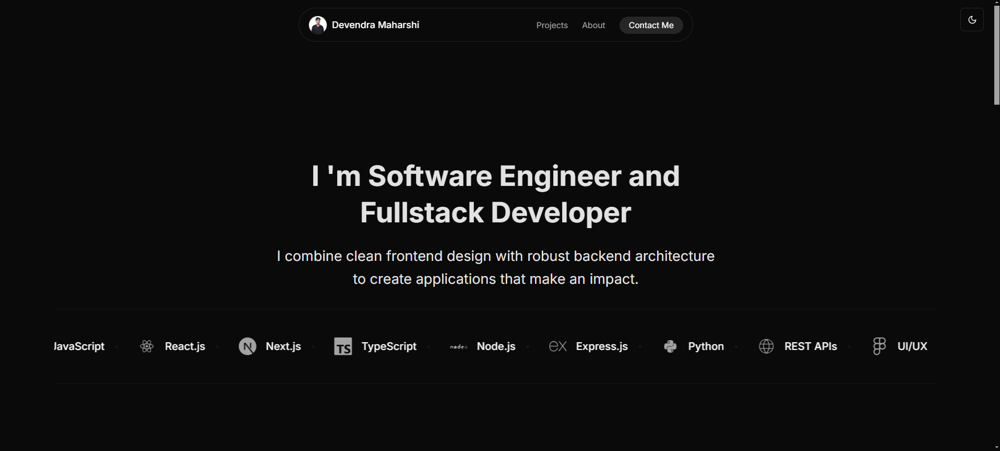

# Devendra Maharshi - Portfolio Website

Welcome to my portfolio website! This project showcases my work, technical skills, and experience as a frontend developer.

---

## 🌟 Project Overview

This portfolio is built with modern web development technologies to create a fast, responsive, and clean interface. It features sections for projects, skills, contact information, and more, designed to provide a comprehensive view of my professional profile.

---

## 🚀 Features

- **Responsive Design:** Fully optimized for desktops, tablets, and mobile devices.
- **Projects Showcase:** Displays featured projects with descriptions and links.
- **Modern UI:** Styled using Tailwind CSS for a clean, minimal design.
- **Fast Deployment:** Hosted and continuously deployed with Vercel.

---

## 🛠️ Technologies Used

- **Next.js**: Framework for building fast, server-rendered React applications.
- **TypeScript**: Enhances JavaScript with static typing.
- **Tailwind CSS**: Utility-first CSS framework for styling.
- **Git**: Version control system for code management.
- **Vercel**: Deployment platform for modern web applications.
- **Node.js**: Used for backend functionality and server-side rendering.

---

## 📸 Screenshot

